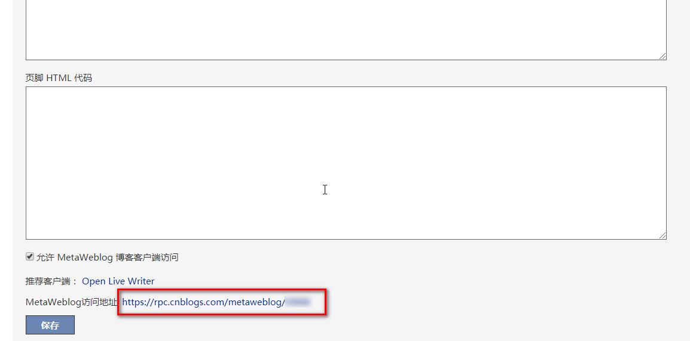
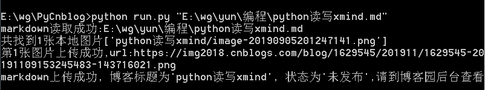

# PyCnblog
博客园上传markdown文件

# 环境

python3

# 配置

在config.py中，填写博客配置信息。

```python
blog_url = 'xxx'
blog_id = 'xxx'
username = 'xxx'
password = 'xxx'
```

## blog_url

blog_url在博客后台>设置，页面最下方



## blog_id

blog_id就是上图打码的部分。

## username

username是登录用户名，跟blog_id不是同一个。

## password

password是密码。

# 运行

执行命令

```python
python run.py "文件路径"  # 注意要用双引号哦
```

# 效果演示

